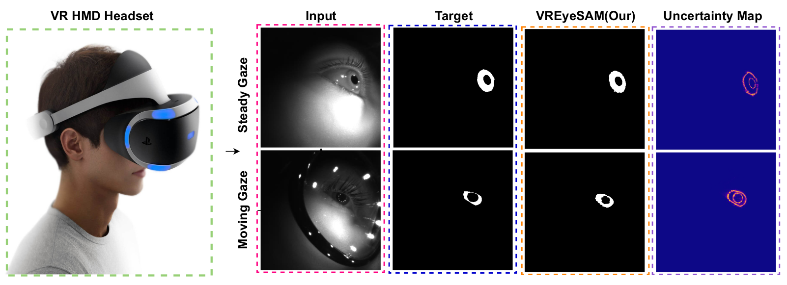
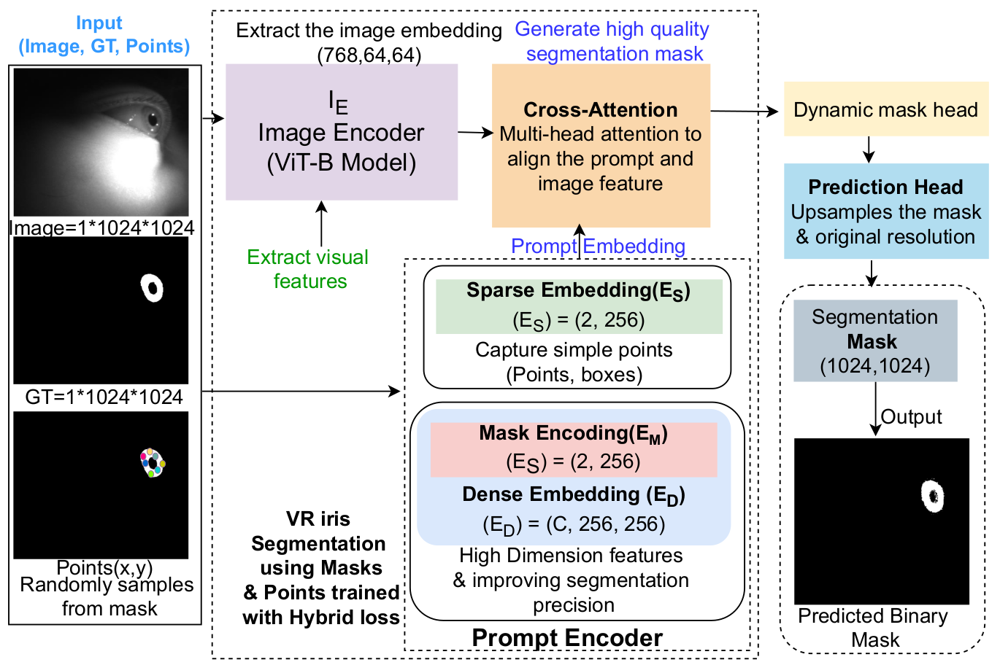
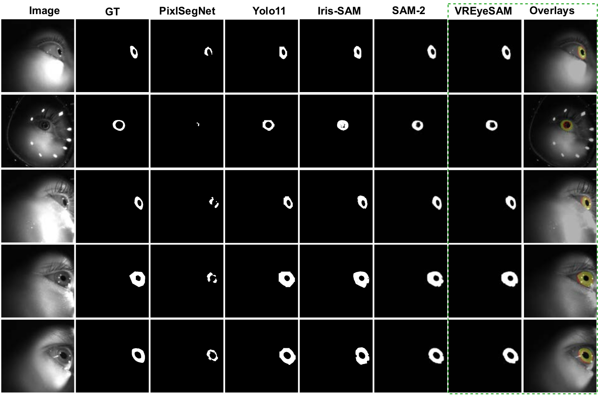

# VREyeSAM : Virtual Reality Non-Frontal Iris Segmentation using Foundational Model with Uncertainty Weighted Loss
Geetanjali Sharma<sup>1</sup>, Dev Nagaich<sup>1</sup>, Gaurav Jaswal<sup>2</sup>, Aditya Nigam<sup>1</sup>, Raghavendra Ramachandra<sup>3</sup>  
<sup>1</sup> Indian Institute of Technology Mandi, India
<sup>2</sup>Division of Digital Forensics, Directorate of Forensic Services, Shimla, Himachal Pradesh 171002, India
<sup>3</sup>Norwegian University of Science and Technology (NTNU), Gjøvik, Norway

<p align="center">
  <a href="https://www.researchgate.net/publication/400248367_VREyeSAM_Virtual_Reality_Non-Frontal_Iris_Segmentation_using_Foundational_Model_with_uncertainty_weighted_loss"></a>
  <a href="#"></a>
  <a href="#"></a>
</p>

**Abstract:** Advancements in virtual and head-mounted devices
have introduced new challenges for iris biometrics, such
as varying gaze directions, partial occlusions, and incon-
sistent lighting conditions. To address these obstacles, we
present VREyeSAM, a robust iris segmentation framework
specifically designed for images captured under both
steady and dynamic gaze scenarios. Our pipeline includes
a quality-aware pre-processing module that automatically
filters out partially or fully closed eyes, ensuring that only
high-quality, fully open iris images are used for training
and inference. In addition, we introduce an uncertainty-
weighted hybrid loss function that adaptively balances
multiple learning objectives, enhancing the robustness of
the model under diverse visual conditions. Evaluated on
the VRBiom dataset, VREyeSAM delivers state-of-the-art
performance, achieving a Precision of 0.751, Recall of
0.870, F1-Score of 0.806, and a mean IoU of 0.647 out-
performing existing segmentation methods by a significant
margin
<p align="center">
  
</p>
Figure: VREyeSAM segmentation on VRBiom non-frontal iris images captured under varied gaze and eyewear conditions. Rows show input images, ground truth masks, and predicted masks with uncertainty maps.

## VREyeSAM Architecture 
<p align="center">
  
</p>
Figure: Virtual reality iris biometrics segmentation using transformer based model where network takes binary mask and points as an
prompt as input to train the model with hybrid loss(Focal + Dice + BCE + Uncertainty weighted loss) function. For inference model predict
a binary mask of the input image without explicitly using points as input.

## Results
<p align="center">
  
</p>
Figure: Visual comparison of iris segmentation results across multiple models. The first row displays the original iris images, the second row shows the corresponding ground truth masks, and rows three to seven illustrate the predicted masks from five different segmentation models. Last Overlays column shows GT mask in green, predicted mask in red, and overlapping area i.e both masks agree in yellow color.

## Setup Instructions

1. Clone the repository:
```bash
git clone https://github.com/GeetanjaliGTZ/VREyeSAM
cd VREyeSAM
```

2. Create virtual environment:
```bash
python3 -m venv vreyesam_env
source vreyesam_env/bin/activate  # Linux/Mac
# or vreyesam_env\Scripts\activate  # Windows
```

3. Install dependencies:
```bash
pip install -r requirements.txt
git clone https://github.com/facebookresearch/segment-anything-2
cd segment-anything-2
pip install -e .
cd checkpoints
```

4. Download SAM2 checkpoints:

**IMPORTANT:** The default `download_ckpts.sh` script downloads SAM2.1 checkpoints. Since VREyeSAM is trained on SAM2 (older version), you need to uncomment the SAM2 download lines before running the script.
```bash
# Open the download script
nano download_ckpts.sh  # or use any text editor (vim, gedit, notepad, etc.)

# Uncomment the SAM2 (older version) download lines
# The SAM2.1 lines are active by default, but we need SAM2
# Look for commented lines like:
#   wget https://dl.fbaipublicfiles.com/segment_anything_2/072824/sam2_hiera_small.pt
# Remove the '#' to uncomment them

# Then run the script
bash download_ckpts.sh
cd ..
```

Alternatively, download SAM2 checkpoint directly:
```bash
wget https://dl.fbaipublicfiles.com/segment_anything_2/072824/sam2_hiera_small.pt
# If downloaded, move it to the checkpoints folder
mv sam2_hiera_small.pt checkpoints/
cd ..
```

Or if you download it manually from a browser, place the `sam2_hiera_small.pt` file in the `segment-anything-2/checkpoints/` directory.

5. Download VREyeSAM fine-tuned weights:

**Option 1: Using Hugging Face CLI (Recommended)**
```bash
# Make sure you're in the VREyeSAM root directory
cd ..  # if you're still in segment-anything-2 directory

# Download the fine-tuned model weights from Hugging Face
huggingface-cli download devnagaich/VREyeSAM VREyeSAM_uncertainity_best.torch --local-dir segment-anything-2/checkpoints/
```

**Option 2: Direct Download**
- Download directly from Hugging Face: [https://huggingface.co/devnagaich/VREyeSAM](https://huggingface.co/devnagaich/VREyeSAM)
- Download the file: `VREyeSAM_uncertainity_best.torch`
- Place it in: `segment-anything-2/checkpoints/`

**Option 3: Manual Installation**
If you don't have `huggingface-cli`, install it first:
```bash
pip install huggingface-hub
```
Then run the download command from Option 1.

## Usage

### Training
To continue training from a checkpoint or start fresh:
```bash
python Training.py
```

### Inference
To generate probabilistic and binary masks:
```bash
python Inference.py
```

### Testing
To generate uncertainty maps:
```bash
python Test.py
```

## Project Structure
```
VREyeSAM/
├── Training.py              # Training script with uncertainty-weighted loss
├── Inference.py             # Inference script for mask generation
├── Test.py                  # Testing script for uncertainty visualization
├── requirements.txt         # Python dependencies
├── .gitignore              # Git ignore rules
├── segment-anything-2/     # SAM2 repository (cloned during setup)
│   └── checkpoints/        # Model checkpoints
│       ├── sam2_hiera_small.pt
│       └── VREyeSAM_uncertainity_best.torch
├── VRBiomSegM/            # Dataset directory (not included)
│   ├── train/
│   │   ├── images/
│   │   ├── masks/
│   │   └── pretrained_model/
│   └── test/
│       └── images/
└── VREyeSAM_results/      # Output directory (generated during inference)
    ├── PROBABILISTIC_MASK_PREDICTION/
    ├── BINARY_MASK_PREDICTION/
    └── test_uncertainty_maps/
```

## Dataset Access

The VRBiomSegM dataset is not included in this repository. To obtain access to the dataset, please contact:

📧 **Email:** geetanjalisharma546@gmail.com

Please include the following in your request:
- Your name and affiliation
- Purpose of usage
- Brief description of your research

## Notes
- All model checkpoints (`.pt`, `.torch`, `.pth`) are excluded from version control
- Generated outputs (masks, plots) are also excluded from the repository
- Training requires CUDA-capable GPU

## Citation

If you find this work useful, please cite our paper:

```bibtex
@article{sharma2025vreyesam,
  title={VREyeSAM: Virtual Reality Non-Frontal Iris Segmentation using Foundational Model with Uncertainty Weighted Loss},
  author={Sharma Geetanjali, Nagaich Dev, Jaswal Gaurav, Nigam Aditya, and Ramachandra Raghavendra},
  Conference={IJCB},
  year={2025}
}
